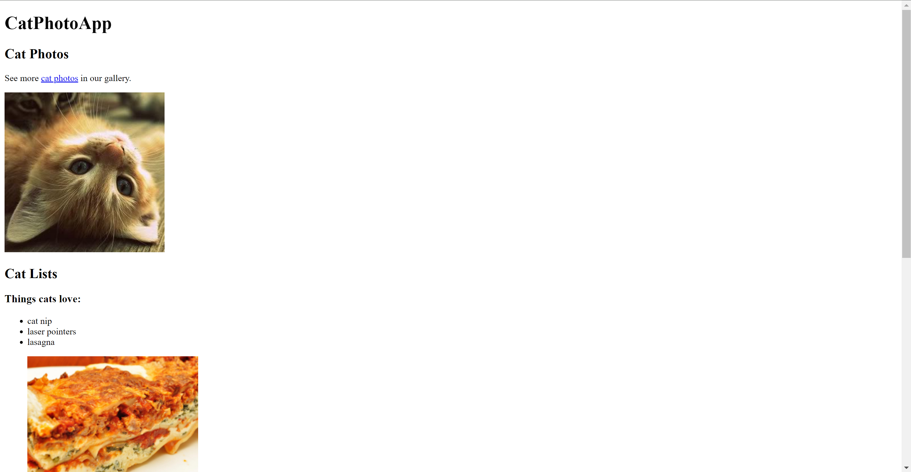

<!DOCTYPE html>
<html lang="en">
<head>
<meta charset="UTF-8">
<meta name="viewport" content="width=device-width, initial-scale=1.0">
<title>Cat Photo App</title>
</head>
<body>
<h1>Cat Photo App</h1>

CatPhotoApp is a simple web application built with HTML. It showcases adorable cat photos, lists things cats love and hate, and provides a form for users to submit their cat photos.

<h2>Table of Content</h2>
<ul>
    <li><a href="#introduction">Introduction</a></li>
    <li><a href="#project-structure">Project Structure</a></li>
    <li><a href="#features">Features</a></li>
    <li><a href="#getting-started">Getting Started</a></li>
    <li><a href="#usage">Usage</a></li>
    <li><a href="#contributing">Contributing</a></li>
    <li><a href="#preview-image">Preview Image</a></li>
    <li><a href="#contact-information">Contact Information</a></li>
    <li><a href="#credits">Credits</a></li>
    <li><a href="#license">License</a></li>
</ul>

<h2 id="introduction">Introduction</h2>

CatPhotoApp is a simple and fun web application that displays cute cat photos, allows users to explore what cats love and hate, and provides a form for submitting personal cat photos.

<h2 id="project-structure">Project Structure</h2>
<pre>
├── index.html
├── README.md
</pre>

<h2 id="features">Features</h2>
<ul>
    <li><strong>Cat Photos:</strong> View a collection of cute cat photos.</li>
    <li><strong>Cat Lists:</strong> Explore what cats love and hate, with accompanying images.</li>
    <li><strong>Submission Form:</strong> Submit your own cat photos along with your cat's indoor/outdoor preference and personality.</li>
    <li><strong>Responsive Design:</strong> The app is designed to work seamlessly on various devices and screen sizes.</li>
</ul>

<h2 id="getting-started">Getting Started</h2>
<h3>Prerequisites</h3>

To run this project, you only need a web browser.

<h3>Installation</h3>
<ol>
    <li>Clone the repository:</li>
    <pre><code>git clone https://github.com/Yashi-Singh-1/A-Cat-Photo-App.git</code></pre>
    <li>Open <code>index.html</code> in your web browser.</li>
</ol>

<h2 id="usage">Usage</h2>

Open the <code>index.html</code> file in a web browser to view the app. Navigate through the photos, lists, and form to enjoy the full experience.

<h2 id="contributing">Contributing</h2>

Contributions are welcome! Fork the repository, make your changes, and submit a pull request.

<h2 id="preview-image">Preview Image</h2>

<h2 id="contact-information">Contact Information</h2>

For any questions or suggestions, feel free to contact:

<ul>
    <li><a href="https://www.linkedin.com/in/yashi-singh-b4143a246">LinkedIn (https://www.linkedin.com/in/yashi-singh-b4143a246)</a></li>
    <li><a href="https://github.com/Yashi-Singh-1/A-Cat-Photo-App">GitHub</a></li>
</ul>

<h2 id="credits">Credits</h2>
<ul>
    <li>Cat photos: Courtesy of <a href="https://www.freecodecamp.org/learn/2022/responsive-web-design/learn-html-by-building-a-cat-photo-app/step-1">freeCodeCamp's curriculum resources</a>.</li>
    <li>Inspired by <a href="https://www.freecodecamp.org/learn/2022/responsive-web-design/learn-html-by-building-a-cat-photo-app/step-1">freeCodeCamp's projects</a>.</li>
</ul>

<h2 id="license">License</h2>

This project is licensed under the MIT License - see the <a href="https://github.com/Yashi-Singh-1/A-Cat-Photo-App?tab=MIT-1-ov-file">LICENSE</a> file for details.

